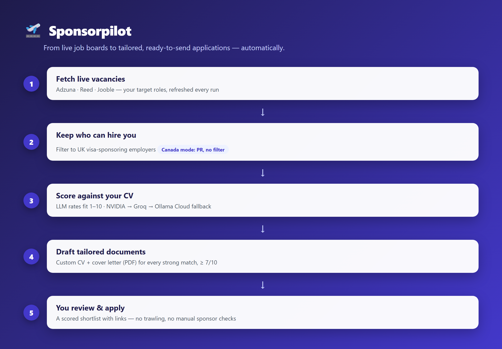
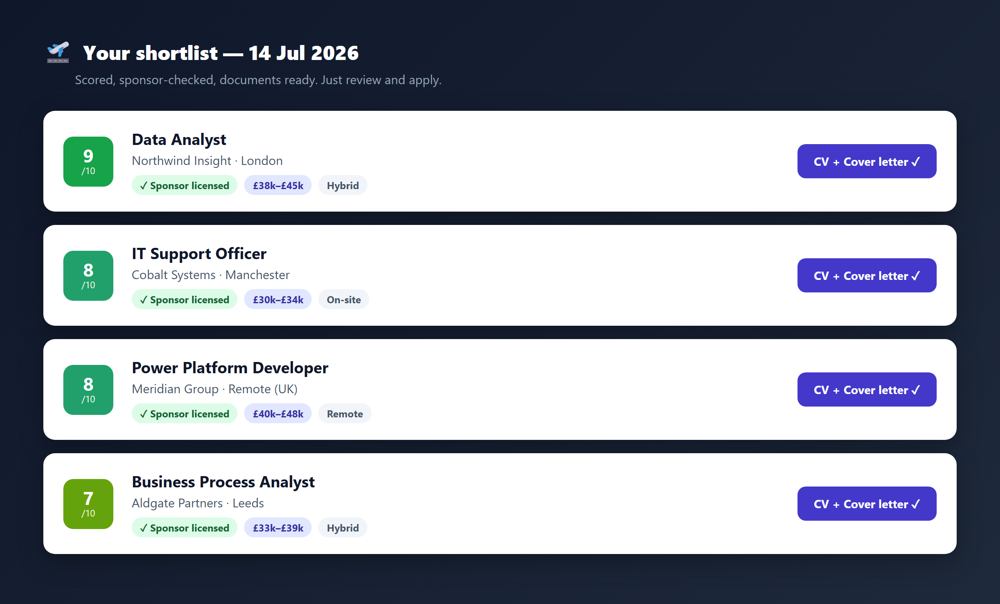

# Sponsorpilot

An automated, LLM-powered job-hunting assistant. Every run pulls live vacancies
from job-board APIs, keeps only employers who can actually hire you, scores each
job against your CV, and builds a complete **apply pack** for the best matches:
a tailored CV and cover letter (as polished PDFs), a ready-to-send application
email, and the hiring contact's email when one can be found. Your daily job is
to review the shortlist and hit send, not to trawl listings.

It runs entirely on **free** API tiers and keeps all your personal data on your
own machine.



## Quick start (no coding needed)

New to this and just want to use it? Follow these steps once. Budget ~20
minutes, mostly signing up for free accounts.

1. **Install Python.** Download it from [python.org/downloads](https://www.python.org/downloads/).
   On the first install screen, tick **"Add Python to PATH"**.
2. **Download this project.** On its GitHub page, click the green **Code**
   button → **Download ZIP**, then unzip it somewhere like your Desktop.
3. **Open a terminal in that folder.** On Windows, open the unzipped folder,
   type `cmd` in the address bar, and press Enter.
4. **Install the tool's parts.** Paste this and press Enter:
   ```bash
   pip install -r requirements.txt
   ```
5. **Get your free keys.** You need **at least one job board** and **at least
   one AI provider**. Sign up (all free) and keep the keys handy. The setup
   wizard will ask for them:
   - Job board: [Adzuna](https://developer.adzuna.com) (works for UK *and*
     Canada, the easiest single choice)
   - AI provider: [Groq](https://console.groq.com), [Google Gemini](https://aistudio.google.com)
     *or* [NVIDIA NIM](https://build.nvidia.com). More providers = fewer
     rate-limit stalls.
6. **Run the setup wizard.** Paste this and press Enter:
   ```bash
   python src/main.py
   ```
   The first time, it walks you through pasting your keys. Just follow the
   prompts (press Enter to skip anything you don't have).
7. **Add your CV.** Put your CV as a Word **.docx** file into the
   **`data/input`** folder (the wizard tells you the exact name to use).
8. **Run it for real.** Run `python src/main.py` again. Pick a country when
   asked, then open **`data/output/<Country>/<today>/`** to see your apply packs.

On Windows, after the first setup you can just double-click **`run_daily.bat`**
to run it each day.

> The rest of this README is the detailed reference. You don't need it to get
> started.

## What you get each day

```
data/output/UK/2026-10-05/
├── report.md                          ← the day's shortlist with scores and links
├── With_Email/                        ← a contact email was found: just send it
│   └── Acme_Ltd_IT_Support_Analyst/
│       ├── APPLY.txt                  ← everything to apply, in one place
│       ├── CV.pdf
│       ├── CoverLetter.pdf
│       └── Mark as applied.bat        ← double-click once you've applied
└── No_Email/                          ← apply via the posting / careers page
    └── ...
data/output/UK/Applied/                ← folders move here when marked applied
```

**`APPLY.txt`** has the match score and why it matches, the job link, salary
and location, sponsor status (UK), the contact email (and where it was found),
the ATS keywords your CV covers or misses, and the full application email,
subject line included, ready to paste.

**Finished an application?** Double-click **`Mark as applied.bat`** in its
folder. The job is marked applied, drops off your pending list, and the folder
moves into `Applied/`, so each day's folder only holds what's still to do.



## How it works

```
Job boards (Adzuna / Reed / Jooble / Careerjet / JSearch / Arbeitnow)
        │  live vacancies for your target roles
        ▼
[UK only] UK sponsor-licence filter        ← keep employers that can sponsor a visa
        ▼
SQLite state (data/jobs.db)                 ← dedup: nothing is ever processed twice
        ▼
Title pre-filter (free, in code)            ← drop senior / dev roles before spending LLM calls
        ▼
LLM scoring 1–10 against your CV profile    ← one consistent judge model; documents at score ≥ 7
        ▼
ATS keywords pulled from the posting        ← woven into the CV where you can honestly claim them
        ▼
Tailored CV + cover letter + email          ← validated: no placeholders, filler or invented roles
        ▼
Hiring-contact search                       ← posting first, then the employer's own website
        ▼
Typeset PDFs, sorted into With_Email / No_Email, plus data/applications.md
```

State lives in SQLite, so a vacancy seen yesterday is never re-scored or
re-generated, and rejected jobs are remembered so they are never paid for
twice. Each job carries a status (`new → shortlisted → generated → applied`)
across runs.

## Features

- **Two countries.** UK and Canada. Pick `uk`, `ca`, or `both` at startup (or
  with `--country`). The UK path filters employers against the official
  sponsor-licence register; the Canada path skips that (for holders of PR /
  work authorization) and searches nationwide, including remote roles.
- **Multi-board.** Adzuna (UK + Canada), Reed (UK), Jooble (Canada), Careerjet
  (UK + Canada), JSearch (Google for Jobs: LinkedIn, Indeed, Glassdoor and more)
  and Arbeitnow (UK, no key). All free. JSearch's 200 requests/month are spread
  over the month automatically, rotating through your searches. A job found on
  several boards is only processed once. Configurable per country.
- **Resilient LLM waterfall.** Groq, Gemini, Hugging Face, NVIDIA NIM, Requesty,
  OpenRouter, Ollama Cloud, Mistral and Cerebras, all through one
  OpenAI-compatible client. Rate limits and outages fail over automatically,
  and spare keys per provider are used as extra fallbacks. Writing uses the
  strongest available model; scoring pins a single model so every job is
  judged on the same scale.
- **Tailored, honest documents.** Each application gets a CV and cover letter
  rewritten for that role, emphasising relevant experience without inventing
  anything or relabelling you as the advertised job title. Every document is
  checked for placeholders, chatty filler and a missing header, and is
  regenerated once if it fails.
- **ATS keyword coverage.** Must-have terms are extracted from each posting,
  used in the CV where your experience supports them, and the covered/missing
  list is shown in `APPLY.txt` so a thin match is visible.
- **Application email.** A short, tailored email per job, including an optional
  right-to-work line per country (set in `.env`).
- **Hiring-contact discovery.** Looks for a real, published email in the job
  description and posting page, then on the employer's own website (careers
  and contact pages). Recruiting inboxes are preferred; named people are used
  only as a fallback and flagged in `APPLY.txt` so you can check them first.
  Emails are found, never guessed.
- **Gmail drafts (optional).** `python src/draft_emails.py` turns every
  application with a contact into a Gmail draft with the CV and cover letter
  attached. Nothing is ever sent automatically.
- **Professional PDFs.** Clean typesetting: aligned bullets, clear section
  headings, a two-column skills list, sensible spacing. CVs fit on two pages.
- **Rate-limited generation.** Caps documents per run (highest scores first);
  the rest stay shortlisted and roll over to the next run.
- **Desktop notification** when a run finishes (Windows toast).

## Requirements

- **Python 3.11+** (developed on 3.14)
- **API keys**, all with free tiers:
  | Service | Used for | Get a key |
  |---|---|---|
  | [Adzuna](https://developer.adzuna.com) | UK + Canada vacancies | free |
  | [Reed](https://www.reed.co.uk/developers) | UK vacancies | free |
  | [Jooble](https://jooble.org/api/about) | Canada vacancies | free |
  | [Careerjet](https://www.careerjet.com/partners/api) | UK + Canada vacancies | free publisher key |
  | [JSearch](https://www.openwebninja.com/api/jsearch) | Google for Jobs (LinkedIn, Indeed, Glassdoor...) | free, 200 requests/month |
  | [Arbeitnow](https://www.arbeitnow.co.uk/api/job-board-api) | UK startup / tech vacancies | free, no key |
  | [Groq](https://console.groq.com) | LLM (fast, reliable) | free tier |
  | [Google Gemini](https://aistudio.google.com) | LLM | free tier |
  | [Hugging Face](https://huggingface.co/settings/tokens) | LLM | free tier |
  | [NVIDIA NIM](https://build.nvidia.com) | LLM (strongest writer) | free tier |
  | [Requesty](https://requesty.ai), [OpenRouter](https://openrouter.ai/keys), [Mistral](https://console.mistral.ai), [Ollama Cloud](https://ollama.com), [Cerebras](https://cloud.cerebras.ai) | extra LLM fallbacks | free tiers |

  At least one job board and one LLM provider are required; the rest are
  optional and improve coverage and resilience.
- **Your CV** as a `.docx` file.
- **(UK only)** The latest *Worker and Temporary Worker* sponsor register
  (`.xlsx` or `.csv`) from
  [gov.uk](https://www.gov.uk/government/publications/register-of-licensed-sponsors-workers).

## Setup

```bash
# 1. Clone and enter
git clone https://github.com/maroonberets96/sponsorpilot.git
cd sponsorpilot

# 2. Virtual environment
python -m venv venv
venv\Scripts\activate            # Windows
# source venv/bin/activate       # macOS / Linux

# 3. Dependencies
pip install -r requirements.txt
playwright install chromium      # only needed for the legacy --mode scan

# 4. Configuration
copy .env.example .env           # then edit .env with your keys and filenames

# 5. Input files -> data/input/
#    - your CV .docx        (set CV_FILENAME in .env to its filename)
#    - (UK) the sponsor register (set SPONSOR_XLSX_FILENAME in .env)
```

`data/input/`, `data/google/` and everything the tool generates is gitignored.
Your CV, the database, generated documents, Gmail tokens and your `.env` keys
never leave your machine.

## Usage

```bash
python src/main.py                     # asks which country
python src/main.py --country ca        # skip the prompt (e.g. scheduled task)
python src/main.py --country both
```

On Windows you can just double-click **`run_daily.bat`**.

After a run, open the day's output folder (or `data/applications.md` for every
pending application across days). When you've applied, double-click
**`Mark as applied.bat`** in the job's folder, or use the command line:

```bash
python src/main.py --mark-applied 12 15 18   # IDs shown in applications.md
```

### Gmail drafts (optional)

```bash
python src/draft_emails.py
```

One-time setup: create a Google Cloud OAuth client (Desktop app) for the Gmail
API and save its JSON as `data/google/client_secret.json`. The first run opens a
browser to grant *compose* access; after that it runs unattended. It only
creates drafts and never sends.

### Tuning what it searches for

Edit `src/config.py`:

- `SEARCH_QUERIES`: the queries sent to the job boards (this determines which
  jobs are fetched at all).
- `MANUAL_ROLES`: target roles the LLM scores against, alongside titles it
  infers from your CV.
- `MIN_MATCH_SCORE`, `MAX_DOCS_PER_RUN`, `MAX_JOB_AGE_DAYS`: thresholds.
- `COUNTRIES`: per-country boards, location, sponsor filter and the
  `split_by_email` folder sorting.

Search scope (`JOB_LOCATION`, `JOB_DISTANCE_MILES`, `JOB_LOCATION_CA`) and your
right-to-work lines (`WORK_ELIGIBILITY_UK`, `WORK_ELIGIBILITY_CA`) live in `.env`.

The tool caches an analysis of your CV in `data/cv_profile.json`. **If you
update your CV, delete that file** so it re-analyses on the next run.

### Updating older output

After upgrading, bring already-generated job folders up to the current layout
(rebuilds the PDFs from the saved text, with no LLM calls):

```bash
python src/refresh_folders.py
```

### Modes

- **`--mode jobs`** (default): the API-driven pipeline described above.
- **`--mode scan`** (legacy): scrapes the careers pages of sponsor-register
  companies directly with a headless browser. Slower; requires
  `playwright install`.

## Notes & caveats

- **It visits third-party pages.** To find contact emails, the tool fetches
  job-posting pages, runs a web search for the employer's careers page, and
  reads a few pages of the employer's site. That's expected behaviour, but be
  aware it makes outbound requests to sites it doesn't control.
- **Contact emails are found, never guessed.** Only addresses literally
  published in the posting or on the employer's website are used. Ones from the
  website are labelled in `APPLY.txt`, and a named person who isn't clearly in
  hiring is flagged so you can check before sending. Many employers publish
  none; those jobs land in `No_Email/`.
- **LLM output should be reviewed.** Tailored CVs, cover letters and emails are
  drafts. Read them before sending. The prompts forbid inventing experience,
  but always check.
- **Not affiliated** with Adzuna, Reed, Jooble, any LLM provider, Google, or any
  government body. Respect each API's terms of use.

## Project layout

```
src/
├── main.py              pipeline orchestration + CLI
├── config.py            all tunables and per-country settings
├── first_run.py         setup wizard for new users
├── job_boards.py        Adzuna / Reed / Jooble / Careerjet / JSearch / Arbeitnow clients
├── sponsor_register.py  UK sponsor-licence name matching
├── db.py                SQLite state + dedup
├── matcher.py           title pre-filter + LLM scoring
├── cv_analyzer.py       extracts a target-role profile from your CV
├── ats.py               ATS keyword extraction + coverage
├── generator.py         tailored CV, cover letter and email prompts
├── validation.py        document quality checks + letter greeting/sign-off
├── contact_finder.py    hiring-contact discovery (posting + employer website)
├── pdf_generator.py     Markdown -> typeset PDF
├── job_folder.py        job-folder housekeeping + 'Mark as applied' launcher
├── draft_emails.py      optional Gmail drafts with attachments
├── refresh_folders.py   upgrade already-generated folders
├── scraper.py           headless-browser careers scraping (legacy scan mode)
├── llm_client.py        multi-provider LLM waterfall
└── logger.py            logging setup
```

## License

[MIT](LICENSE).
